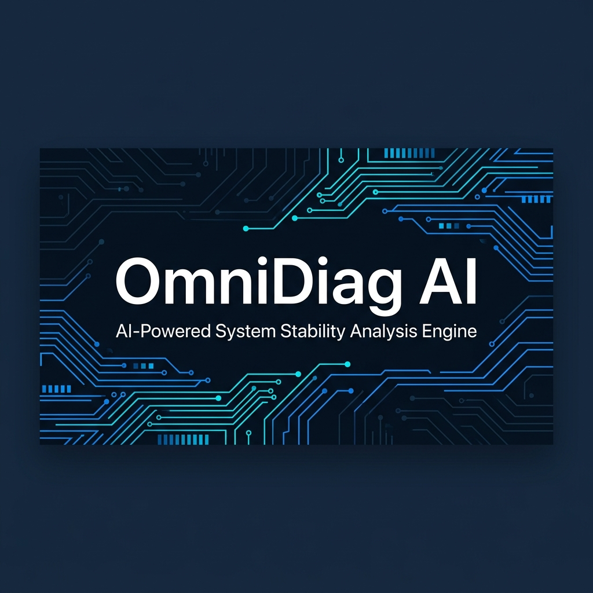
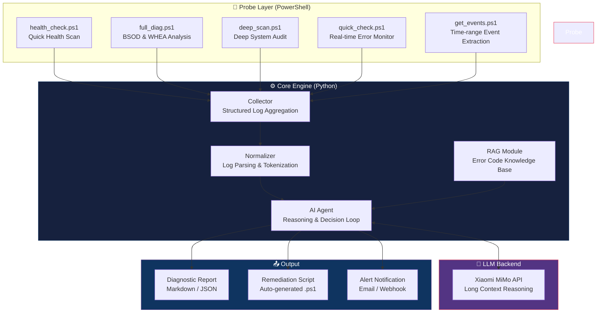

<p align="center">
  
</p>

<h1 align="center">OmniDiag AI</h1>

<p align="center">
  <strong>🔬 AI-Powered Full-Stack System Stability Analysis & Autonomous Remediation Engine</strong>
</p>

<p align="center">
  <a href="#features">Features</a> •
  <a href="#architecture">Architecture</a> •
  <a href="#quick-start">Quick Start</a> •
  <a href="#probe-modules">Probe Modules</a> •
  <a href="#ai-engine">AI Engine</a> •
  <a href="#roadmap">Roadmap</a>
</p>

<p align="center">
  
  
  
  
  
</p>

---

## ❓ The Problem

When enterprise servers or developer workstations encounter **kernel-level crashes** (BSOD, WHEA errors, CPU Vmin shift degradation), traditional monitoring tools can only surface error codes. Engineers must then manually sift through **tens of thousands of lines** of Event Viewer logs, Minidump snapshots, and hardware telemetry data — a process that can take hours or even days.

**OmniDiag AI** closes this gap by combining **deep OS-level diagnostic probes** with the **long-context reasoning capabilities of large language models** to deliver automated root-cause analysis and generate executable remediation scripts — in seconds, not hours.

---

## ✨ Features

| Category | Capability | Status |
|----------|-----------|--------|
| 🔍 **Probe Engine** | Multi-layer OS telemetry collection (SMART, WHEA, Kernel-Power, WER, CBS, Driver conflicts) | ✅ Production |
| 🧠 **AI Reasoning** | LLM-powered root-cause analysis with full log context injection (128K+ token windows) | ✅ Production |
| 🔧 **Auto-Remediation** | AI-generated PowerShell fix scripts with safety validation | ✅ Production |
| 📊 **RAG Pipeline** | Local knowledge base built from Microsoft error code documentation + historical incidents | 🚧 Beta |
| 🔄 **Scheduled Patrol** | Cron-based automated health audits with daily AI-generated reports | 🚧 Beta |
| 🌐 **Multi-Node** | Agent-based distributed collection for server fleet monitoring | 📋 Planned |
| 📈 **Dashboard** | Real-time system health visualization with trend analysis | 📋 Planned |

---

## 🏗️ Architecture



---

## 🚀 Quick Start

### Prerequisites

- Python 3.10+
- PowerShell 5.1+ (Windows built-in) or PowerShell 7+ (cross-platform)
- Xiaomi MiMo API Key ([Get one here](https://xiaomimimo.com))

### Installation

```bash
git clone https://github.com/kzeokytjvwhnrtl13otf-bit/omnidiag-ai.git
cd omnidiag-ai
pip install -r requirements.txt
cp .env.example .env
# Edit .env and add your MiMo API key
```

### Run a Quick Diagnosis

```bash
# Collect system telemetry and run AI analysis
python omnidiag.py diagnose

# Quick health check only (no AI)
python omnidiag.py collect --probe health_check

# Full BSOD analysis with AI reasoning
python omnidiag.py diagnose --probe full_diag --verbose

# Deep audit with auto-remediation script generation
python omnidiag.py diagnose --probe deep_scan --auto-fix
```

---

## 🔬 Probe Modules

All probe modules are located in `probes/` and are written in PowerShell for deep OS-level access.

| Module | Description | Typical Output Size |
|--------|-------------|-------------------|
| `health_check.ps1` | Disk SMART status, device errors, conflicting software, AV detection, OS image health, recent application errors | ~2-5 KB |
| `full_diag.ps1` | Kernel-Power 41 events, WHEA errors, BugCheck reports, CPU throttle events, Minidump file inventory, crash timeline | ~5-20 KB |
| `deep_scan.ps1` | Storage audit, DISM/SFC integrity, failed services, driver conflicts, high-risk filter drivers, crash hotspot analysis | ~3-10 KB |
| `quick_check.ps1` | Real-time error monitor (last 10 min), VMware process detection | ~1-3 KB |
| `get_events.ps1` | Precision time-range event extraction for incident forensics | ~2-50 KB |

> **💡 Why PowerShell?** Unlike Python-based monitoring agents, PowerShell has **native access** to WMI/CIM, Event Viewer, DISM, and kernel-level APIs without any third-party dependencies. This makes our probes zero-dependency and deployable on any Windows machine instantly.

---

## 🧠 AI Engine

### How It Works

1. **Collect**: Probe modules gather raw system telemetry data
2. **Normalize**: Logs are parsed, deduplicated, and structured into a unified JSON schema
3. **Enrich (RAG)**: The normalizer queries a local vector store of Microsoft error codes and known-issue patterns
4. **Reason**: The enriched context (often 50K-100K tokens) is sent to the MiMo LLM for multi-step reasoning
5. **Act**: The LLM produces a structured diagnostic report and, optionally, a remediation script

### Why MiMo?

| Requirement | Why MiMo Excels |
|------------|----------------|
| **Ultra-long context** | Single diagnostic sessions routinely inject 50K-100K tokens of raw logs. MiMo's 128K+ context window handles this natively. |
| **Strong reasoning** | Root-cause analysis requires tracing causal chains across kernel events, driver interactions, and hardware telemetry — a task that demands deep logical reasoning. |
| **Code generation** | Auto-remediation requires generating syntactically correct, safe PowerShell scripts. MiMo's code generation capabilities ensure production-quality output. |
| **Cost efficiency** | Token Plan pricing makes high-volume log analysis economically viable for continuous monitoring scenarios. |

### Token Consumption Profile

```
┌─────────────────────────────────────────────────────────┐
│  Typical Token Usage Per Diagnostic Session              │
├──────────────────────┬──────────────────────────────────┤
│  Probe Data Input    │  30,000 - 80,000 tokens          │
│  RAG Context         │  5,000 - 15,000 tokens           │
│  System Prompt       │  2,000 - 3,000 tokens            │
│  Chain-of-Thought    │  10,000 - 30,000 tokens          │
│  Output (Report+Fix) │  3,000 - 8,000 tokens            │
├──────────────────────┼──────────────────────────────────┤
│  TOTAL per session   │  50,000 - 136,000 tokens         │
│  Daily patrol (24x)  │  1.2M - 3.3M tokens              │
│  Monthly estimate    │  36M - 100M tokens               │
└──────────────────────┴──────────────────────────────────┘
```

---

## 📁 Project Structure

```
omnidiag-ai/
├── omnidiag.py              # Main entry point & CLI
├── config.py                # Configuration management
├── requirements.txt         # Python dependencies
├── .env.example             # Environment variable template
├── LICENSE                  # MIT License
│
├── probes/                  # PowerShell diagnostic probes
│   ├── health_check.ps1     # Quick system health scan
│   ├── full_diag.ps1        # Full BSOD & crash analysis
│   ├── deep_scan.ps1        # Deep system audit
│   ├── quick_check.ps1      # Real-time error monitor
│   └── get_events.ps1       # Time-range event extraction
│
├── core/                    # Core Python modules
│   ├── collector.py         # Probe execution & output capture
│   ├── normalizer.py        # Log parsing & structuring
│   ├── rag.py               # RAG pipeline (error code KB)
│   └── agent.py             # AI reasoning agent
│
├── output/                  # Generated reports & fix scripts
│   ├── reports/             # Diagnostic reports (Markdown/JSON)
│   └── fixes/               # Auto-generated remediation scripts
│
├── knowledge/               # RAG knowledge base
│   ├── whea_codes.json      # WHEA error code reference
│   ├── bugcheck_codes.json  # Windows BugCheck code reference
│   └── known_issues.json    # Historical incident patterns
│
└── docs/                    # Documentation & assets
    ├── assets/              # Images, banners
    └── CONTRIBUTING.md      # Contribution guidelines
```

---

## 🗺️ Roadmap

- [x] Core probe modules (5 probes covering BSOD, WHEA, SMART, drivers, services)
- [x] Python CLI orchestrator with MiMo API integration
- [x] Structured diagnostic report generation
- [x] Auto-remediation script generation with safety checks
- [ ] RAG pipeline with Microsoft error code knowledge base
- [ ] Scheduled patrol mode (cron-based daily health audits)
- [ ] Multi-node agent deployment for server fleet monitoring
- [ ] Web dashboard with real-time health visualization
- [ ] Linux probe module support (journalctl, dmesg, SMART)
- [ ] Alert integrations (Slack, DingTalk, Email, Webhook)

---

## 🤝 Contributing

Contributions are welcome! Please see [CONTRIBUTING.md](docs/CONTRIBUTING.md) for guidelines.

---

## 📄 License

This project is licensed under the MIT License — see the [LICENSE](LICENSE) file for details.

---

<p align="center">
  <sub>Built with 🧠 by H.Y. • Powered by <a href="https://xiaomimimo.com">Xiaomi MiMo</a></sub>
</p>
